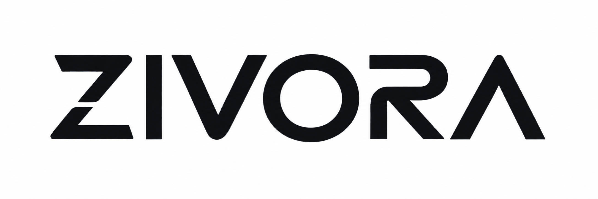

<div align="center">

<table align="center" bgcolor="#ffffff" cellpadding="18" cellspacing="0" style="background:#ffffff;border-radius:18px;overflow:hidden;">
  <tr>
    <td align="center" bgcolor="#ffffff" style="background:#ffffff;border-radius:18px;">
      
    </td>
  </tr>
</table>

# Zivora Logic Ventures

**Software products, business systems, and digital infrastructure.**

We build and operate technology products and infrastructure for businesses and institutions.

[Website](https://www.zivoralabs.xyz) · [Repositories](https://github.com/orgs/Zivora-Logic-Ventures/repositories)

</div>

---

## About

**Zivora Logic Ventures** is a technology company focused on building and operating software products, business systems, and digital infrastructure.

Our work spans enterprise software, backend and platform engineering, infrastructure, automation, financial systems, artificial intelligence, integrations, and developer tooling.

We build around real operational requirements: systems that need to remain secure, auditable, maintainable, and dependable when businesses rely on them every day.

## Products

### SalesPlus

**SalesPlus** is Zivora's business management and ERP platform.

It brings together core operations across sales, point of sale, inventory, warehousing, procurement, accounting, customer management, approvals, reporting, APIs, and integrations.

SalesPlus is being developed as both a complete SaaS product and a platform that external applications can build on.

### Express Cloud

**Express Cloud** is business operations software for organizations that require controlled deployments across private, on-premise, or dedicated infrastructure.

It combines operational workflows with controlled access, financial processes, inventory management, approvals, auditability, and deployment flexibility.

## Operating brands

### Zivora Labs

Our software and technology arm, responsible for products, platforms, infrastructure, integrations, technical research, and the engineering systems behind Zivora's technology portfolio.

### Zivora Systems

Our delivery and systems arm for technology implementations, infrastructure, and organization-specific deployments.

## Engineering principles

- **Reliability** — production systems should behave predictably and recover safely when things go wrong.
- **Security by design** — authorization, data protection, isolation, and least privilege belong in the architecture from the start.
- **Data integrity** — business-critical systems require explicit transaction boundaries, auditability, idempotency, and safe correction paths.
- **Operational clarity** — software should be observable, deployable, supportable, and understandable by the people responsible for running it.
- **Scalable foundations** — products should grow across customers, workloads, integrations, teams, and infrastructure without constant reinvention.
- **Useful software** — technology exists to solve operational problems. Complexity has to earn its place.

## Developer platform

Alongside our applications, we are building APIs and developer tooling that allow external software to work with Zivora platforms.

For SalesPlus, this includes the official JavaScript SDK:

```bash
npm install @zivora/salesplus
```

The SDK is intended to let developers build custom applications and frontends while using SalesPlus infrastructure for business capabilities such as products, customers, inventory, orders, invoices, and related workflows.

## This organization

This GitHub organization is the engineering home of Zivora Logic Ventures.

Repositories here may contain:

- Zivora products
- APIs and SDKs
- infrastructure
- internal platforms
- developer tooling
- websites and technical documentation

Some repositories are public. Commercial source code, internal systems, credentials, infrastructure configuration, and other sensitive assets remain private.

## Security

Security vulnerabilities should not be disclosed through public GitHub issues. Public projects will provide repository-specific reporting instructions through their `SECURITY.md` files.

---

<div align="center">

**Zivora Logic Ventures**

Building software products, business systems, and digital infrastructure.

[www.zivoralabs.xyz](https://www.zivoralabs.xyz)

</div>
